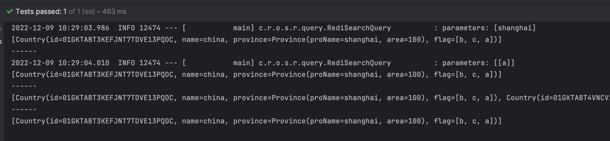

# redis_search_springboot

### First of all: get your own redis-stack
1. create a docker-compose.yml file like below:
```docker
version: "3.9"

services:
  redis:
    image: "redis/redis-stack:edge"
    ports:
      - "6379:6379"
    environment:
      - "REDIS_ARGS=--appendonly yes"
    volumes:
      - ./data:/data
    deploy:
      replicas: 1
      restart_policy:
        condition: on-failure
```

2. then start your redis-stack with the following bash command:
```bash
docker-compose up -d
```

3. connect the redis-stack with [redis-insight](https://redis.com/redis-enterprise/redis-insight/)

### Secondary: create a spring boot project
1. springboot version
```xml
    <parent>
    <groupId>org.springframework.boot</groupId>
    <artifactId>spring-boot-starter-parent</artifactId>
    <version>2.6.4</version>
    <relativePath/> <!-- lookup parent from repository -->
    </parent> 
```
2. install redis pom
```xml
    <repositories>
        <repository>
            <id>snapshots-repo</id>
            <url>https://s01.oss.sonatype.org/content/repositories/snapshots/</url>
        </repository>
    </repositories>
```
```xml
    <dependencies>
        <dependency>
            <groupId>com.redis.om</groupId>
            <artifactId>redis-om-spring</artifactId>
            <version>0.3.0-SNAPSHOT</version>
        </dependency>
    </dependencies>
```
2. create Country and Province model:

```java
@Document
@Data
public class Country {

    @Id
    @Indexed
    private String id;

    @Indexed
    private String name;

    @Indexed
    private Province province;

    @Indexed
    private Set<String> flag;
}
```
```java
@Data
public class Province {

    @Indexed
    private String proName;

    @Indexed
    private Integer area;

}
```
3. create country repository and service, ensure scan path
```java
public interface CountryRepository extends RedisDocumentRepository<Country, String> {

    Iterable<Country> findByProvince_ProName(String name);

    Iterable<Country> findByFlag(Set<String> flag);
}
```
```java
@Service
public class CountryService {
    @Autowired
    EntityStream entityStream;

    public Iterable<Country> findAllCountry() {
        return entityStream.of(Country.class)
                .limit(10)
                .collect(Collectors.toList());
    }

    public Iterable<Country> findByName(String name) {
        return entityStream.of(Country.class)
                .filter(Country$.NAME.eq(name))
                .limit(10)
                .collect(Collectors.toList());
    }
}
```
```java
@EnableRedisDocumentRepositories(basePackages = "com.pengo.redis.search.*")
@SpringBootApplication
public class RedisSearchSpringbootApplication {

    public static void main(String[] args) {
        SpringApplication.run(RedisSearchSpringbootApplication.class, args);
    }

}
```
4. create a test method and init base data
```java
@SpringBootTest
class RedisSearchSpringbootApplicationTests {

    @Autowired
    private CountryRepository countryRepository;
    @Autowired
    private CountryService countryService;

    @Test
    void initCountry() {
        countryRepository.deleteAll();

        Country c1 = new Country();
        Province p1 = new Province();
        p1.setProName("shanghai");
        p1.setArea(100);
        c1.setName("china");
        c1.setProvince(p1);
        c1.setFlag(Set.of("a", "b", "c"));

        Country c2 = new Country();
        Province p2 = new Province();
        p2.setProName("beijing");
        p2.setArea(200);
        c2.setName("china2");
        c2.setProvince(p2);
        c2.setFlag(Set.of("d", "e", "f"));

        countryRepository.saveAll(List.of(c1, c2));
    }

    @Test
    void testCountry() {
        Iterable<Country> shanghai = countryRepository.findByProvince_ProName("shanghai");
        System.out.println(shanghai);
        System.out.println("------");
        Iterable<Country> a = countryRepository.findByFlag(Set.of("a"));
        System.out.println(a);
        System.out.println("------");
        Iterable<Country> allCountry = countryService.findAllCountry();
        System.out.println(allCountry);
        System.out.println("------");
        Iterable<Country> china = countryService.findByName("china");
        System.out.println(china);
    }
}
```

5. now, you can open your redis-insight and click the refresh button. Bingo~


### Finally, enjoy the redis-stack

1. run the test method, and you will get what you want


