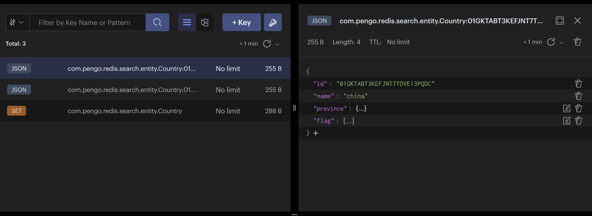

# redis_search_springboot

### First of all: get your own redis-stack
1. create a docker-compose.yml file like below:
```docker
version: "3.9"

services:
  redis:
    image: "redis/redis-stack:edge"
    ports:
      - "6379:6379"
    environment:
      - "REDIS_ARGS=--appendonly yes"
    volumes:
      - ./data:/data
    deploy:
      replicas: 1
      restart_policy:
        condition: on-failure
```

2. then start your redis-stack with the following bash command:
```bash
docker-compose up -d
```

3. connect the redis-stack with [redis-insight](https://redis.com/redis-enterprise/redis-insight/)

### Secondary: create a spring boot project
1. springboot version
```xml
    <parent>
    <groupId>org.springframework.boot</groupId>
    <artifactId>spring-boot-starter-parent</artifactId>
    <version>2.6.4</version>
    <relativePath/> <!-- lookup parent from repository -->
    </parent> 
```
2. install redis pom
```xml
    <repositories>
        <repository>
            <id>snapshots-repo</id>
            <url>https://s01.oss.sonatype.org/content/repositories/snapshots/</url>
        </repository>
    </repositories>
```
```xml
    <dependencies>
        <dependency>
            <groupId>com.redis.om</groupId>
            <artifactId>redis-om-spring</artifactId>
            <version>0.3.0-SNAPSHOT</version>
        </dependency>
    </dependencies>
```
2. create School and Student model:

```java
@NoArgsConstructor
@AllArgsConstructor
@Document
@Data
public class School {

    @Id
    @Indexed
    private String id;

    @Searchable
    private String name;

    @Indexed
    private Integer history;

    @Searchable
    private String address;

    @Indexed
    private Student student;

    @Indexed
    private Set<String> subject;

}
```
```java
@NoArgsConstructor
@AllArgsConstructor
@Data
public class Student {

    @Indexed
    private String name;

    @Indexed
    private Integer age;

}
```
3. create school repository and ensure scan path
```java
public interface SchoolRepository extends RedisDocumentRepository<School, String> {

}
```
```java
@EnableRedisDocumentRepositories(basePackages = "com.pengo.redis.search.*")
@SpringBootApplication
public class RedisSearchSpringbootApplication {

    public static void main(String[] args) {
        SpringApplication.run(RedisSearchSpringbootApplication.class, args);
    }

}
```
4. create a test method and init base data
```java
@SpringBootTest
class RedisSearchSpringbootApplicationTests {

    @Autowired
    private SchoolRepository schoolRepository;

    @Test
    void initData() {
        Student zhangsan = new Student("张三", 18);
        School school = new School("1001", "青岛科技大学", 50, "青岛市", zhangsan, Set.of("机械", "化工"));

        schoolRepository.save(school);
    }
}
```

5. now, you can open your redis-insight and click the refresh button. Bingo~


6. let's add more data into redis
```java
@SpringBootTest
class RedisSearchSpringbootApplicationTests {

    @Autowired
    private SchoolRepository schoolRepository;

    @Test
    void initData() {
        schoolRepository.deleteAll();

        Student zhangsan = new Student("张三", 18);
        School qdScience = new School("1001", "青岛科技大学", 50, "青岛市", zhangsan, Set.of("机械", "化工"));

        Student lisi = new Student("lisi", 20);
        School sdCollege = new School("1002", "山东大学", 60, "济南市", lisi, Set.of("音乐", "美术"));

        Student wangwu = new Student("wangwu", 22);
        School ytCollege = new School("1003", "烟台大学", 70, "烟台市", wangwu, Set.of("跳高", "跳远"));

        Student zhaoliu = new Student("zhaoliu", 24);
        School rzCollege = new School("1004", "日照大学", 80, "日照市", zhaoliu, Set.of("语文", "数学"));

        Student xiaoming = new Student("xiaoming", 26);
        School hzCollege = new School("1005", "菏泽大学", 90, "菏泽市", xiaoming, Set.of("政治", "英语"));


        schoolRepository.saveAll(List.of(qdScience, sdCollege, ytCollege, rzCollege, hzCollege));
    }
}
```

### Finally, enjoy the redis-stack